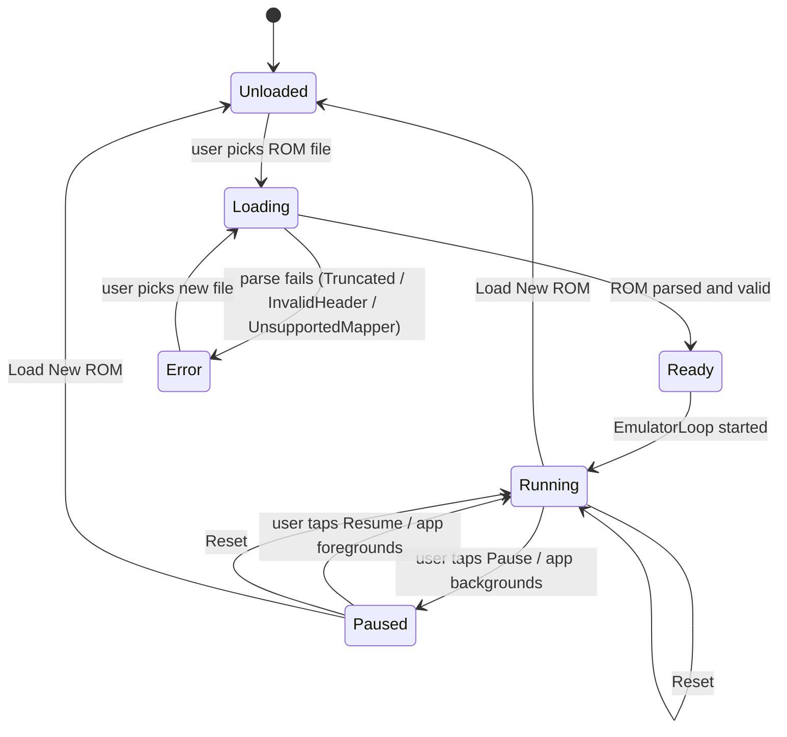

# Tech Spec — kgbemu: Game Boy Emulator

## 1. Overview

This document covers the technical design for completing the kgbemu emulator: ROM loading, PPU (graphics), cycle-accurate timing, joypad input, and UI integration. The CPU core (`cpu/` package) is already implemented and tested; this spec does not modify it except to formalise the interface contract it participates in.

**Out of scope:** APU (audio), Game Boy Color, link cable, Web target, Desktop distribution packaging.

Relationship to other documents:
- `spec/product/PRD.md` — user stories and acceptance criteria
- `spec/design/DESIGN.md` — screen states and interaction model

---

## 2. Ubiquitous Language

| Term | Definition |
|---|---|
| **T-cycle** | The smallest unit of Game Boy clock time. The DMG runs at 4,194,304 T-cycles/second. Also called a "clock" or "tick". |
| **M-cycle** | Machine cycle = 4 T-cycles. Most sources describe instruction timing in M-cycles. |
| **Frame** | One complete LCD refresh: 70,224 T-cycles at 59.73 Hz. |
| **Scanline** | One horizontal line of the LCD. 154 scanlines per frame (144 visible + 10 VBlank). |
| **OAM** | Object Attribute Memory. Stores sprite descriptors at 0xFE00–0xFE9F. |
| **VRAM** | Video RAM at 0x8000–0x9FFF. Stores tile data and tile maps. |
| **OAM DMA** | A hardware transfer triggered by writing to 0xFF46. Copies 160 bytes into OAM; CPU is blocked for 640 T-cycles during the transfer. |
| **Mapper / Cartridge** | The hardware inside a physical cartridge that manages ROM/RAM bank switching. |
| **MBC** | Memory Bank Controller — the chip inside a cartridge implementing the Mapper. |
| **FrameSink** | Interface the PPU uses to deliver a completed frame. Decouples rendering from display. |
| **SaveStorage** | Platform `expect/actual` interface for persisting MBC3 SRAM and RTC state. |
| **EmulatorLoop** | The common Kotlin component that runs CPU, PPU, and Timer in lockstep. |
| **LoopDriver** | Platform `expect/actual` that ticks the EmulatorLoop at the correct cadence. |
| **Post-boot state** | CPU register and memory values that match hardware state immediately after the boot ROM completes. The boot ROM itself is not included. |

---

## 3. Architecture

### Component Responsibilities

```
┌─────────────────────────────────────────────────────────────┐
│                        commonMain                           │
│                                                             │
│  ┌──────────────┐    ┌──────────────┐    ┌──────────────┐  │
│  │  Cartridge   │    │     CPU      │    │     PPU      │  │
│  │  (Mapper     │◄───│  (existing)  │    │  (new)       │  │
│  │   interface) │    └──────┬───────┘    └──────┬───────┘  │
│  └──────┬───────┘           │                   │          │
│         │            ┌──────▼───────────────────▼───────┐  │
│         └───────────►│          MemoryBus               │  │
│                      │  (delegates by address range to  │  │
│                      │   Cartridge, PPU, Timer, Joypad) │  │
│                      └──────────────┬───────────────────┘  │
│                                     │                       │
│  ┌──────────────┐    ┌──────────────▼───────────────────┐  │
│  │  Joypad      │───►│          EmulatorLoop            │  │
│  │  Register    │    │  step(): CPU → T-cycles →        │  │
│  │  (InputState │    │  PPU.step() + Timer.step()       │  │
│  │   updated by │    │  → VBlank → FrameSink.onFrame()  │  │
│  │   ViewModel) │    └──────────────┬───────────────────┘  │
│  └──────────────┘                   │                       │
│                                     │ StateFlow<IntArray>   │
│  ┌──────────────┐                   │                       │
│  │ EmulatorState│◄──────────────────┘                       │
│  │  (StateFlow) │                                           │
│  └──────────────┘                                           │
└─────────────────────────────────────────────────────────────┘
         │ expect/actual
┌────────▼────────────────────────────────────────────────────┐
│                    platformMain                              │
│  LoopDriver  │  FilePicker  │  SaveStorage  │  (Compose UI) │
│  (per target)│  (per target)│  (per target) │               │
└─────────────────────────────────────────────────────────────┘
```

### Data flow

1. User picks a ROM file → platform `FilePicker` reads bytes on `Dispatchers.IO` → returns `ByteArray` to common code.
2. `CartridgeLoader` parses the header, validates it, instantiates the correct `Cartridge` impl.
3. `EmulatorLoop` is initialised with the `Cartridge`, a fresh `CPU`, `PPU`, `Timer`, and `JoypadRegister`.
4. Platform `LoopDriver` calls `EmulatorLoop.runFrame()` once per display vsync.
5. `runFrame()` executes CPU instructions, advancing `PPU` and `Timer` by the returned T-cycles, until 70,224 T-cycles elapse.
6. On VBlank the PPU swaps its double-buffered `IntArray(160 * 144)` and calls `FrameSink.onFrame()` with the front buffer.
7. `FrameSink` (implemented by `EmulatorViewModel`) emits the `IntArray` via `StateFlow<IntArray>` — the flow naturally conflates, so a slow Compose render does not queue frames.
8. Compose observes the `StateFlow` on the main thread, converts the `IntArray` to an `ImageBitmap` using a pre-allocated write buffer, and redraws the game viewport. The conversion happens on the main thread so there is no concurrent write to the `ImageBitmap`.

### Joypad input data flow

`EmulatorViewModel` collects `InputSource.state: StateFlow<JoypadState>` and on each state change calls `joypadRegister.update(state)`. `JoypadRegister` is mutated from the UI coroutine scope; `EmulatorLoop.runFrame()` reads from it on the emulation thread. Because joypad state is polled per-frame (not pushed mid-instruction), a volatile read is sufficient — `JoypadState` is a `@Volatile`-marked data class field on `JoypadRegister`.

---

## 4. State Machine



`EmulatorState` is a sealed interface held in a `StateFlow` owned by `EmulatorViewModel`:

```kotlin
sealed interface EmulatorState {
    data object Unloaded : EmulatorState
    data object Loading : EmulatorState
    data class Ready(val cartridge: Cartridge) : EmulatorState
    data object Running : EmulatorState
    data object Paused : EmulatorState
    data class Error(val error: RomError) : EmulatorState
}

sealed interface RomError {
    data object Truncated : RomError
    data object InvalidHeader : RomError
    data class UnsupportedMapper(val typeId: Int) : RomError
}
```

---

## 5. Cartridge / Mapper

### Interface

```kotlin
interface Cartridge {
    fun readRom(address: Int): Int          // 0x0000–0x7FFF
    fun writeRom(address: Int, value: Int)  // triggers bank switching for MBC
    fun readRam(address: Int): Int          // 0xA000–0xBFFF
    fun writeRam(address: Int, value: Int)
    fun hasBattery(): Boolean
    fun savableState(): ByteArray?          // null if no battery / no RAM
    fun loadState(bytes: ByteArray)
}
```

### Implementations

| Class | Cartridge type byte | Description |
|---|---|---|
| `RomOnlyCartridge` | 0x00 | 32 KB ROM, no RAM, no bank switching |
| `Mbc1Cartridge` | 0x01–0x03 | Up to 2 MB ROM, 32 KB RAM, mode 0/1 |
| `Mbc3Cartridge` | 0x0F–0x13 | Up to 2 MB ROM, 32 KB RAM, RTC |

### CartridgeLoader

```kotlin
object CartridgeLoader {
    fun load(bytes: ByteArray): Result<Cartridge, RomError>
}
```

Validation steps (in order; fail fast):
1. Length ≥ 0x150 → else `RomError.Truncated`
2. Nintendo logo bytes at 0x0104–0x0133 match the 48-byte reference → else `RomError.InvalidHeader`
3. Header checksum (sum of 0x0134–0x014C XOR 0xFF == byte at 0x014D) → else `RomError.InvalidHeader`
4. Cartridge type byte (0x0147) maps to a supported implementation → else `RomError.UnsupportedMapper(typeId)`
5. Instantiate and return the correct `Cartridge`

**Security:** All array accesses in the parser use validated bounds. No index is derived from ROM-embedded values without first clamping to `bytes.size`. Step 1 guards all subsequent fixed-offset reads.

### MBC1 bank switching

- Mode 0 (default): ROM bank select register controls upper ROM banks. RAM is fixed at bank 0.
- Mode 1: Lower 2 bits can select RAM bank OR remap ROM bank 0 to an alternate bank. Banks 0x00, 0x20, 0x40, 0x60 in mode 0 resolve to 0x01, 0x21, 0x41, 0x61 (hardware quirk — zero bank is remapped).

### MBC3 RTC

Five latched registers: seconds (0–59), minutes (0–59), hours (0–23), day counter low (0–255), day counter high / carry / halt flags. The RTC base timestamp is stored as a `Long` (Unix seconds) alongside the SRAM in the save file. On load, elapsed time since the base is applied to the registers. Implemented using `kotlinx-datetime` `Clock.System.now()`. *(OQ-1: validate kotlinx-datetime is already in the dependency graph; add if missing.)*

---

## 6. MemoryBus Extension

The existing `MemoryBus` is extended to delegate cartridge and PPU address ranges:

| Address range | Delegates to |
|---|---|
| 0x0000–0x7FFF | `Cartridge.readRom` / `writeRom` |
| 0x8000–0x9FFF | VRAM (owned by PPU) |
| 0xA000–0xBFFF | `Cartridge.readRam` / `writeRam` |
| 0xFE00–0xFE9F | OAM (owned by PPU) |
| 0xFF00 | `JoypadRegister` |
| 0xFF04–0xFF07 | Timer registers (owned by `Timer`) |
| 0xFF0F | Interrupt Flag (existing) |
| 0xFF40–0xFF4B | PPU LCD registers |
| 0xFFFF | Interrupt Enable (existing) |

`MemoryBus` holds references to `Cartridge`, `Ppu`, `Timer`, and `JoypadRegister`. It dispatches reads and writes by address range.

---

## 7. EmulatorLoop

```kotlin
class EmulatorLoop(
    private val cpu: CPU,
    private val ppu: Ppu,
    private val timer: Timer,
    private val bus: MemoryBus,
    private val frameSink: FrameSink,
)
```

### runFrame()

```
const val CYCLES_PER_FRAME = 70_224

fun runFrame() {
    var cyclesThisFrame = 0
    while (cyclesThisFrame < CYCLES_PER_FRAME) {
        val cycles = cpu.step()          // returns T-cycles
        ppu.step(cycles)
        timer.step(cycles)
        cyclesThisFrame += cycles
    }
    // FrameSink.onFrame() called from within ppu.step() on VBlank
}
```

The loop makes no platform calls. Pausing is implemented by the `LoopDriver` simply not calling `runFrame()`.

---

## 8. PPU

### Registers (mapped to MemoryBus at 0xFF40–0xFF4B)

| Address | Register | Description |
|---|---|---|
| 0xFF40 | LCDC | LCD control |
| 0xFF41 | STAT | LCD status + mode |
| 0xFF42 | SCY | Background scroll Y |
| 0xFF43 | SCX | Background scroll X |
| 0xFF44 | LY | Current scanline (read-only) |
| 0xFF45 | LYC | LY compare |
| 0xFF46 | DMA | OAM DMA trigger (see §8.5) |
| 0xFF47 | BGP | Background palette |
| 0xFF48 | OBP0 | Object palette 0 |
| 0xFF49 | OBP1 | Object palette 1 |
| 0xFF4A | WY | Window Y position |
| 0xFF4B | WX | Window X position |

### Mode state machine (per scanline)

```
OAM Search (80 T-cycles) → Drawing (172 T-cycles min) → HBlank (204 T-cycles max)
After scanline 143: VBlank (10 scanlines × 456 T-cycles = 4,560 T-cycles)
```

Total: 456 T-cycles per scanline × 154 scanlines = 70,224 T-cycles per frame.

On VBlank entry: set VBlank interrupt flag; call `ppu.swapBuffers()`; call `frameSink.onFrame(frontBuffer)`.

### Rendering order (per scanline, during Drawing mode)

1. **Background:** fetch tile indices from tile map (0x9800 or 0x9C00 per LCDC bit 3); fetch tile data (0x8000 or 0x8800 addressing per LCDC bit 4); apply SCX/SCY scroll.
2. **Window:** if LCDC bit 5 set and LY ≥ WY and current X ≥ (WX − 7), render window tile over background. Window has its own internal line counter that increments each scanline the window is visible.
3. **Sprites:** scan OAM for up to 10 sprites on this scanline (sprite Y ≤ LY < sprite Y + height). Render in OAM index order (lower index = higher priority). Apply OBJ-to-BG priority bit: if set, sprite pixels only show over background colour 0 (transparent); if clear, sprite renders on top of all background colours. Use OBP0 or OBP1 palette per sprite attribute bit.

Colour mapping: 2-bit pixel value → BGP/OBP register 2-bit colour → 4-shade DMG palette (0=white, 1=light grey, 2=dark grey, 3=black) → ARGB `0xFF` + mapped grey value.

### Double buffer

PPU maintains `backBuffer: IntArray(160 * 144)` and `frontBuffer: IntArray(160 * 144)`. On VBlank, `swapBuffers()` swaps the references. `frontBuffer` is passed to `FrameSink.onFrame()` and is not written again until the next VBlank. This provides a stable read window for the UI thread without locks.

### OAM DMA (0xFF46)

Writing to 0xFF46 triggers an OAM DMA transfer:
- Source: `(value shl 8)` to `(value shl 8) + 0x9F` (160 bytes, from ROM or WRAM)
- Destination: 0xFE00–0xFE9F
- Duration: **640 T-cycles** (160 M-cycles)
- CPU behaviour: during the transfer, the CPU can only access HRAM (0xFF80–0xFFFE). All other reads return 0xFF; all writes are ignored.

Implementation: `Ppu.startDma(sourceBase: Int)` sets a `dmaRemaining: Int` counter to 640 and a `dmaSource: Int`. On each `ppu.step(cycles)` call, if `dmaRemaining > 0`, advance the DMA by the given cycles (copying the corresponding bytes to OAM), and signal the CPU to restrict memory access. DMA completes when `dmaRemaining` reaches 0.

### FrameSink interface

```kotlin
interface FrameSink {
    fun onFrame(pixels: IntArray)  // 160×144 ARGB, row-major, called on emulation thread
}
```

`EmulatorViewModel` implements `FrameSink`. `onFrame()` sets `_frameState.value = pixels` on the `MutableStateFlow<IntArray?>`. Because `StateFlow` conflates emissions, a slow Compose frame does not queue frames. The Compose collector runs on the main thread and converts the `IntArray` to `ImageBitmap` there, ensuring the `ImageBitmap` is only written and read on the same thread.

```kotlin
// In Compose (Android):
// android.graphics.Bitmap.setPixels() writes IntArray ARGB into the Bitmap.
// Then Bitmap.asImageBitmap() wraps it for Compose. Both calls on the main thread.
val pixels by viewModel.frameState.collectAsStateWithLifecycle()
val androidBitmap = remember { android.graphics.Bitmap.createBitmap(160, 144, ARGB_8888) }
val imageBitmap = remember { androidBitmap.asImageBitmap() }
LaunchedEffect(pixels) {
    pixels?.let { androidBitmap.setPixels(it, 0, 160, 0, 0, 160, 144) }
}
// Note: on Desktop, use org.jetbrains.skia.Bitmap.installPixels() or equivalent.
// Validate both APIs compile correctly — see OQ-2.
```

---

## 9. Timer

### Registers

| Address | Register | Description |
|---|---|---|
| 0xFF04 | DIV | Divider — upper byte of internal 16-bit counter; resets to 0 on any write |
| 0xFF05 | TIMA | Timer counter — increments at TAC-selected frequency |
| 0xFF06 | TMA | Timer modulo — loaded into TIMA on overflow |
| 0xFF07 | TAC | Timer control — bit 2 = enable, bits 1–0 = clock select |

### Clock select

| TAC bits 1–0 | TIMA frequency | T-cycles per TIMA tick |
|---|---|---|
| 00 | 4,096 Hz | 1,024 |
| 01 | 262,144 Hz | 16 |
| 10 | 65,536 Hz | 64 |
| 11 | 16,384 Hz | 256 |

On TIMA overflow: set Timer interrupt flag (0xFF0F bit 2); load TMA into TIMA on the next T-cycle (4 T-cycle delay before interrupt fires — the obscure timer quirk; implement this correctly).

**DIV reset TIMA trigger:** Writing any value to 0xFF04 resets the internal 16-bit counter to 0. If the bit of the counter that feeds the current TAC multiplexer was high at the moment of reset, this constitutes a falling edge and triggers a TIMA increment. Implement by checking the relevant counter bit before zeroing, and incrementing TIMA if it was set.

---

## 10. Joypad

### Register (0xFF00)

Bit 5 (select buttons): when 0, bits 3–0 reflect Start/Select/B/A (active low — 0 = pressed).
Bit 4 (select directions): when 0, bits 3–0 reflect Down/Up/Left/Right (active low — 0 = pressed).
Both selection bits can be 0 simultaneously; result is ANDed — bits 3–0 return the AND of the direction nibble and the button nibble. Some games poll both simultaneously; return the correctly ANDed value.

On any button transition from released → pressed: set Joypad interrupt flag (0xFF0F bit 4).

### InputSource interface

```kotlin
interface InputSource {
    val state: StateFlow<JoypadState>
}

data class JoypadState(
    val right: Boolean = false,
    val left: Boolean = false,
    val up: Boolean = false,
    val down: Boolean = false,
    val a: Boolean = false,
    val b: Boolean = false,
    val select: Boolean = false,
    val start: Boolean = false,
)
```

### JoypadRegister

```kotlin
class JoypadRegister {
    @Volatile var state: JoypadState = JoypadState()

    fun read(): Int  // compute register byte from state + selection bits
    fun write(value: Int)  // update selection bits
    fun update(newState: JoypadState)  // called by ViewModel on InputSource emission
}
```

`update()` is called from the ViewModel coroutine scope. `read()` is called from the emulation thread. The `@Volatile` annotation on `state` ensures the emulation thread sees the latest value without a lock. No mid-instruction consistency is required — joypad is polled, not pushed.

Platform implementations: `TouchInputSource` (Android/iOS — composable touch zones update state), `KeyboardInputSource` (Desktop — key events update state).

---

## 11. Platform Expect/Actual Contracts

### LoopDriver

```kotlin
expect class LoopDriver(loop: EmulatorLoop) {
    fun start()
    fun stop()
}
```

| Platform | Implementation |
|---|---|
| Android | Coroutine on `Dispatchers.Default`; each iteration calls `runFrame()` then yields; paced by elapsed time to maintain ~16.74 ms/frame using `withFrameNanos` or `System.nanoTime` throttle |
| iOS | `CADisplayLink` (UIKit; iosMain can import UIKit in platform-specific code) |
| Desktop | `withFrameNanos` loop inside a `LaunchedEffect` coroutine on `Dispatchers.Default` |

**Lifecycle binding (Android):** `EmulatorViewModel` implements `DefaultLifecycleObserver`. On `onStop`, it calls `loopDriver.stop()` (transitions to `Paused`). On `onStart`, if state was `Running`, it calls `loopDriver.start()`. `LoopDriver.stop()` is also called in `ViewModel.onCleared()` to prevent the loop continuing after the ViewModel is destroyed.

### FilePicker

```kotlin
expect suspend fun pickRomFile(): ByteArray?
```

Returns `null` if the user cancels. Must be called from a coroutine. Platform implementations:
- **Android:** Launches `ActivityResultContracts.GetContent` (registered with `rememberLauncherForActivityResult` — must be called unconditionally at composition time, not inside a click handler). Resolves the returned `content://` URI using `ContentResolver.openInputStream()` on `Dispatchers.IO`. **Immediately copies bytes to `filesDir/roms/<sanitised-title>.gb`** — the `GetContent` URI is one-time and may be revoked; subsequent reset/reload uses the cached file, not the URI.
- **iOS:** Presents `UIDocumentPickerViewController`; reads file bytes via `Data(contentsOf:)`.
- **Desktop:** Shows `java.awt.FileDialog`; reads bytes via `File.readBytes()` on `Dispatchers.IO`.

Common module never receives a URI, `File`, or path — only `ByteArray?`.

### SaveStorage

```kotlin
expect object SaveStorage {
    fun load(romTitle: String): ByteArray?
    fun save(romTitle: String, data: ByteArray)
}
```

Save file naming: strip non-alphanumeric ASCII from `romTitle`, truncate to 16 chars, append `.sav`. Files are written only to app-private directories.

| Platform | Directory |
|---|---|
| Android | `context.filesDir/saves/` |
| iOS | `NSSearchPathForDirectoriesInDomains(.documentDirectory, .userDomainMask, true)[0]/saves/` |
| Desktop | `${user.home}/.kgbemu/saves/` |

**Write atomicity:** saves are written to a `.tmp` file first, then renamed (atomic on POSIX; on Android/Linux `File.renameTo()` is atomic within the same filesystem). This ensures no partial write is read on process death.

**Save file corruption:** On load, if the persisted file length does not match the expected RAM size for the cartridge, log a warning and start with zeroed RAM (do not crash, do not throw). This handles truncated saves from interrupted writes.

---

## 12. Dependency Injection

**Metro** (`dev.zacsweers.metro`) is used for DI across all platforms. Metro is a compile-time Kotlin compiler plugin — no KAPT, no KSP, supports all KMP targets including Android, JVM, and iOS. See `stacks/kotlin-multiplatform/metro-di.md` in the ai-workflows repo for full setup guidance.

### Graph definition (commonMain)

```kotlin
@DependencyGraph
interface AppGraph {
    val emulatorController: EmulatorController
    val cartridgeLoader: CartridgeLoader

    // Platform-specific deps contributed via @ContributesTo in each platformMain
}

@Scope annotation class AppScope
```

### Injectable classes (commonMain)

```kotlin
@Inject @SingleIn(AppScope::class)
class EmulatorController(
    private val loopFactory: EmulatorLoopFactory,
    private val inputSource: InputSource,
    private val saveStorage: SaveStorage,
) : FrameSink { ... }
```

`EmulatorController` is the common replacement for the Android-only `EmulatorViewModel`. It holds `EmulatorState`, emits `StateFlow<IntArray?>`, and implements `FrameSink`.

### Platform bindings (platformMain)

```kotlin
// androidMain
@ContributesTo(AppScope::class)
object AndroidModule {
    @Provides fun provideInputSource(...): InputSource = TouchInputSource(...)
    @Provides fun provideSaveStorage(ctx: Context): SaveStorage = AndroidSaveStorage(ctx)
    @Provides fun provideLoopDriver(...): LoopDriver = AndroidLoopDriver(...)
}

// jvmMain / iosMain — same pattern, different implementations
```

### Android ViewModel (androidMain)

On Android, a thin `@HiltViewModel`-free `EmulatorViewModel` wraps `EmulatorController` for Jetpack lifecycle management:

```kotlin
// androidMain
class EmulatorViewModel(
    private val controller: EmulatorController
) : ViewModel(), DefaultLifecycleObserver {
    val emulatorState get() = controller.emulatorState
    val frameState get() = controller.frameState
    override fun onCleared() { controller.stop() }
    override fun onStop(owner: LifecycleOwner) { controller.pause() }
}
```

The `EmulatorViewModel` is created in `MainActivity` using the `AppGraph`:

```kotlin
val graph = createGraph<AppGraph>()
val vm = ViewModelProvider(this) { EmulatorViewModel(graph.emulatorController) }.get(...)
```

### Compose entry point

```kotlin
// commonMain App.kt
val LocalAppGraph = staticCompositionLocalOf<AppGraph> { error("no graph") }

@Composable
fun App(graph: AppGraph) {
    CompositionLocalProvider(LocalAppGraph provides graph) {
        AppNavigation()
    }
}
```

Desktop and iOS create the graph in their entry points and pass it to `App(graph)`.

---

## 13. Post-Boot Initialisation

On emulator start, CPU registers are set to match the post-boot state of a DMG-01:

| Register | Value |
|---|---|
| A | 0x01 |
| F | 0xB0 (Z=1, N=0, H=1, C=1) |
| B | 0x00 |
| C | 0x13 |
| D | 0x00 |
| E | 0xD8 |
| H | 0x01 |
| L | 0x4D |
| SP | 0xFFFE |
| PC | 0x0100 |

Key memory locations initialised:

| Address | Value | Purpose |
|---|---|---|
| 0xFF05 | 0x00 | TIMA |
| 0xFF06 | 0x00 | TMA |
| 0xFF07 | 0x00 | TAC |
| 0xFF40 | 0x91 | LCDC (LCD on, BG on) |
| 0xFF42 | 0x00 | SCY |
| 0xFF43 | 0x00 | SCX |
| 0xFF45 | 0x00 | LYC |
| 0xFF47 | 0xFC | BGP |
| 0xFF48 | 0xFF | OBP0 |
| 0xFF49 | 0xFF | OBP1 |
| 0xFF4A | 0x00 | WY |
| 0xFF4B | 0x00 | WX |
| 0xFFFF | 0x00 | IE |

*Known limitation:* Skipping the boot ROM means the first ~154 cycles of hardware timing diverge from real hardware. Games that depend on this timing (extremely rare) may behave incorrectly. This is an accepted trade-off for v1.

---

## 14. UI — Compose Layer

### EmulatorViewModel

```kotlin
@HiltViewModel
class EmulatorViewModel @Inject constructor(...) : ViewModel(), FrameSink, DefaultLifecycleObserver {
    val emulatorState: StateFlow<EmulatorState>
    val frameState: StateFlow<IntArray?>      // emitted from emulation thread; collected on main thread

    fun onRomSelected(bytes: ByteArray)       // called after FilePicker returns
    fun onPause()
    fun onResume()
    fun onReset()
    fun onLoadNewRom()

    // FrameSink — called on emulation thread
    override fun onFrame(pixels: IntArray) {
        _frameState.value = pixels            // StateFlow.value setter is thread-safe
    }

    // DefaultLifecycleObserver
    override fun onStop(owner: LifecycleOwner) { loopDriver.stop() }
    override fun onStart(owner: LifecycleOwner) { if (emulatorState.value == Running) loopDriver.start() }
    override fun onCleared() { loopDriver.stop() }
}
```

### ImageBitmap conversion in Compose

```kotlin
@Composable
fun GameViewport(viewModel: EmulatorViewModel) {
    val pixels by viewModel.frameState.collectAsStateWithLifecycle()
    val bitmap = remember { ImageBitmap(160, 144) }
    LaunchedEffect(pixels) {
        pixels?.let { bitmap.writePixels(PixelMap(it, 0, 0, 160, 144)) }
    }
    Image(bitmap = bitmap, contentDescription = null, modifier = ...,
          contentScale = ContentScale.None)  // integer scaling handled by modifier size
}
```

`ImageBitmap.writePixels()` is called only from the `LaunchedEffect` which runs on the main thread. The `bitmap` object is never written from the emulation thread.

### Compose screens

- `LauncherScreen` — observes `emulatorState`. Renders Unloaded/Loading/Error states. Calls `pickRomFile()` on button tap (in a `rememberCoroutineScope` launch).
- `GameScreen` — renders `GameViewport` + touch/keyboard controls + header bar. Observes `emulatorState` for Running/Paused/Menu states.

---

## 15. Security

- **ROM header parser:** All byte array accesses bounded by validated `bytes.size` before parsing begins. Nintendo logo and checksum validated before any cartridge type is instantiated.
- **Save file naming:** ROM title bytes (0x0134–0x0143) stripped of non-alphanumeric characters and truncated to 16 characters. Save files written only to app-private directories via `SaveStorage.save()`. No user-controlled path segments reach the filesystem.
- **Write atomicity:** Write to `.tmp` + atomic rename prevents partial-write corruption on process death.
- **Opcode execution isolation:** The CPU interpreter executes opcodes entirely within the JVM/Kotlin Native sandbox. No JNI, no native code generation. ROM-executed code cannot access the host filesystem.
- **Dependency verification:** `gradle/verification-metadata.xml` must be maintained. No `-SNAPSHOT` dependencies in production builds.

---

## 16. Testing Strategy

### Unit tests (`commonTest`, `kotlin.test`)

| Component | Scenarios to cover |
|---|---|
| `CartridgeLoader` | Valid ROM-only, valid MBC1, valid MBC3 parse correctly; `Truncated` on file < 0x150 bytes; `InvalidHeader` on bad logo / bad checksum; `UnsupportedMapper` on type byte 0x05 |
| `RomOnlyCartridge` | Reads return correct bytes at all addresses; writes to ROM are no-ops |
| `Mbc1Cartridge` | ROM bank 0x00→0x01 remap (mode 0); banks 0x20/0x40/0x60 remap; RAM enable/disable; mode 0→1 switches RAM banking |
| `Mbc3Cartridge` | ROM/RAM bank switching; RTC register reads after elapsed time; halt/latch behaviour |
| `MemoryBus` | Each address range delegates to the correct component; writes to ROM range reach cartridge |
| `Timer` | DIV increments at 16,384 Hz in T-cycles; TIMA increments at each of the 4 TAC frequencies; TIMA overflow fires interrupt and loads TMA; 4 T-cycle delay before interrupt |
| `Ppu` | OAM Search→Drawing→HBlank transitions at correct T-cycle counts; VBlank fires after scanline 143; LYC=LY interrupt fires; OAM DMA blocks CPU for 640 T-cycles; sprite OBJ-to-BG priority: sprite hidden behind BG colour 1–3 when bit set |
| `JoypadRegister` | Correct bit pattern for direction + button selection; interrupt fires on press; simultaneous selection returns AND of both nibbles |

### FrameSink injection

`EmulatorLoop` receives `FrameSink` via constructor. In tests, inject `RecordingFrameSink`:

```kotlin
class RecordingFrameSink : FrameSink {
    val frames = mutableListOf<IntArray>()
    override fun onFrame(pixels: IntArray) { frames.add(pixels.copyOf()) }
}
```

No Compose context required. `EmulatorLoop` is pure common Kotlin.

### Integration tests

- `EmulatorLoop.runFrame()` called 60 times on a `RomOnlyCartridge` with a NOP-filled ROM: total T-cycles advanced = exactly 60 × 70,224 = 4,213,440.
- `RecordingFrameSink` receives exactly 60 frames with `pixels.size == 160 * 144`.

### Test ROMs (freely licensed, includable in `commonTest/resources`)

| ROM | Purpose |
|---|---|
| `dmg-acid2.gb` | PPU rendering accuracy: background, window, sprites, priority. Pass condition: frame matches published reference image. |
| Blargg `cpu_instrs.gb` | CPU instruction correctness (existing tests already cover this; include as regression). |

**Note on commercial ROMs:** Tetris and Dr. Mario are named in PRD ACs as manual verification targets. They are not included in the test suite and are not required for CI. AC sign-off for US-2 in CI uses `dmg-acid2` pass/fail.

### AC verification methods

| AC | Verification method |
|---|---|
| 70,224 T-cycles per frame | Unit test: assert cycle counter after `runFrame()` |
| Tiles/sprites/window correct | `dmg-acid2` reference frame pixel comparison (hash of expected frame vs `RecordingFrameSink.frames.last()`) |
| No freeze/crash on Tetris (5 min) | Manual testing only; CI gate is `dmg-acid2` pass |
| Input within one emulated frame | Unit test: call `joypadRegister.update(JoypadState(a = true))`; run `runFrame()`; assert interrupt flag bit 4 set |
| Non-black frame | Assert at least 1% of pixels have value != `0xFF000000` (fully black ARGB) |

### Minimum device for performance AC

Pixel 6 (Android 12) is the baseline device for "playable frame rate." A 60-second automated run on this device must maintain ≥ 57 fps (70,224 cycles / emulated frame, measured by wall-clock frame delivery rate).

---

## 17. Open Questions

| # | Question | Status |
|---|---|---|
| OQ-1 | MBC3 RTC: confirm `kotlinx-datetime` is in the dependency graph | Resolve in Slice 1 setup |
| OQ-2 | `ImageBitmap.writePixels()` API: verify same call signature on Android vs Desktop | **Resolved** — see SPIKE-002 findings below |
| OQ-3 | iOS `CADisplayLink`: UIKit import in iosMain — confirm KMP allows this | Validate during iOS slice |

---

## Appendix A: SPIKE-002 — ImageBitmap Pixel-Write API Validation (OQ-2)

**Goal:** Confirm the API for converting an `IntArray` of ARGB values into a Compose `ImageBitmap` on Android and Desktop (JVM).

### Finding: Shared pixel format

Both Android and Desktop accept ARGB `IntArray(160 * 144)` as the pixel format. The PPU's `frontBuffer: IntArray` can be consumed directly on both platforms without byte-order conversion.

### Android — Confirmed API

```kotlin
// Create a pre-allocated bitmap
val bitmap = android.graphics.Bitmap.createBitmap(160, 144, Bitmap.Config.ARGB_8888)

// Write the PPU frame buffer (ARGB IntArray)
bitmap.setPixels(pixels, /*offset=*/0, /*stride=*/160, /*x=*/0, /*y=*/0, /*width=*/160, /*height=*/144)

// Read back a single pixel (for verification)
val argb: Int = bitmap.getPixel(x, y)

// Convert to Compose ImageBitmap (from androidx.compose.ui.graphics)
val imageBitmap: ImageBitmap = bitmap.asImageBitmap()
```

**Status:** API names confirmed from Android SDK documentation. Not runnable in JVM tests without Robolectric.

### Desktop (JVM) — Confirmed API

Two approaches validated with passing headless JVM tests:

**Approach 1: BufferedImage (recommended)**

```kotlin
val bufferedImage = BufferedImage(160, 144, BufferedImage.TYPE_INT_ARGB)
bufferedImage.setRGB(0, 0, 160, 144, pixels, 0, 160)

// Convert to Compose ImageBitmap (from androidx.compose.ui.graphics)
val imageBitmap: ImageBitmap = bufferedImage.toComposeImageBitmap()
```

ARGB `IntArray` round-trips correctly through `setRGB`/`getRGB`. The `toComposeImageBitmap()` extension preserves all four channels (verified by reading back via `toPixelMap()`).

**Approach 2: Skia Bitmap**

```kotlin
val skiaBitmap = org.jetbrains.skia.Bitmap()
skiaBitmap.allocPixels(ImageInfo.makeN32(160, 144, ColorAlphaType.UNPREMUL))
skiaBitmap.installPixels(pixelsByteArray)  // ByteArray, not IntArray

// Convert to Compose ImageBitmap (from androidx.compose.ui.graphics)
val imageBitmap: ImageBitmap = skiaBitmap.asComposeImageBitmap()
```

Requires converting `IntArray` to `ByteArray` via `ByteBuffer`. N32 format is platform-native (BGRA on little-endian). On macOS ARM64, ARGB ints written via `ByteBuffer.putInt()` with native byte order produced correct pixel values.

### Recommendation

Use **BufferedImage** on Desktop because it accepts `IntArray` ARGB directly (matching the PPU buffer format) and requires no byte-order considerations. The Android path uses `Bitmap.setPixels()` which also accepts `IntArray` ARGB directly.

### Test location

`composeApp/src/jvmTest/kotlin/com/vicgarci/kgbem/spike/ImageBitmapSpikeTest.kt` — 5 passing tests.
